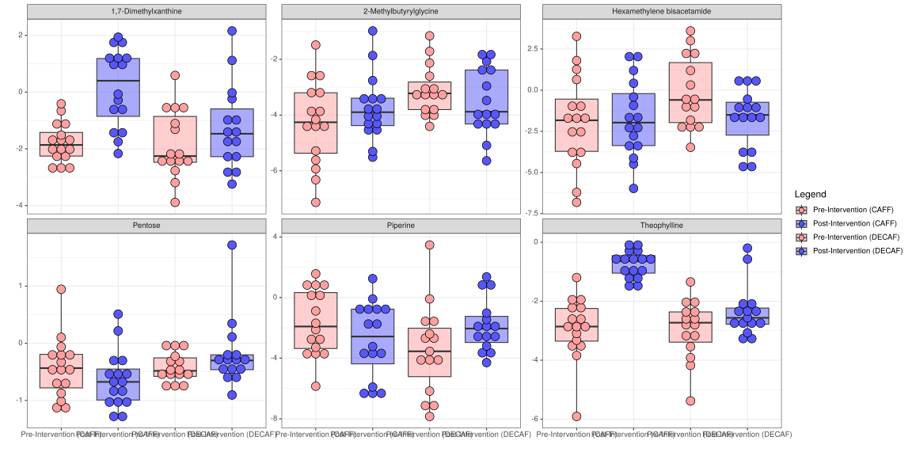
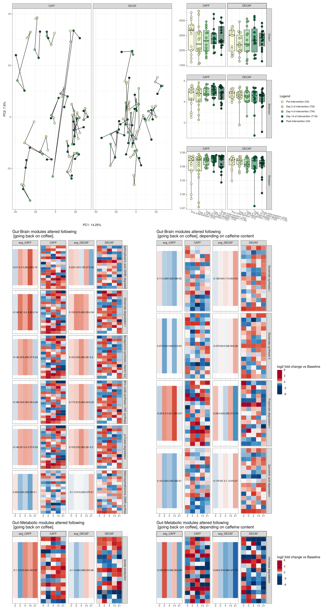

<p align="justify">
<!-- README.md is generated from README.Rmd. Please edit that file -->

In Experiment 1, we’re looking at differences in the microbiome between
coffee drinkers and non-coffee drinkers.

``` r
source("scripts/ex1_baseline_differences_CD_vs_NCD.R")
```

``` r
(ex1pca | (ex1alpha / ex1DA)) / 
  ((ex1_cyta  + ex1_cytb  + ex1_metab_forest) + plot_layout(widths = c(1,1,5))) + plot_layout(heights = c(2,3))
```

<!-- -->

In Experiment 2, we’re looking at features that return to non-coffee
drinker levels post washout (coffee abstinence).

``` r
source("scripts/ex_2_acute_and_full_withdrawal.R")
```

``` r
(ex_RESTpca + (ex_RESTalpha/ex_RESTDA)) / (ex_REST_metab_forest_a + ex_REST_metab_forest_b)  + plot_layout(heights = c(2,3))
```

<!-- -->

In Experiment 3, we’re looking at the effects of going back on either
caffeinated or decaffeinated coffee post-washout (coffee abstinence).

``` r
source("scripts/ex3_intervention_v3_vs_v4.R")
```

``` r
ex3pca + ex3alpha + plot_layout(guides = 'collect')
```

<!-- -->

``` r
ex3metab
```

<!-- -->

In this additional microbiome experiment 3B, we’re looking at the acute
effects of going back on either caffeinated or decaffeinated coffee
post-washout (coffee abstinence).

``` r
source("scripts/ex_INTERVENTION_acute_recaf_or_decaf.R")
```

    ## [1] "Using the following formula: x ~ Legend_ex_INTERVENTION + Treatment + (1 | participant_ID) + "
    ## [2] "Using the following formula:     Legend_ex_INTERVENTION:Treatment"                            
    ## [1] "Adjusting for FDR using Benjamini & Hochberg's procedure."

``` r
((ex_INTERVENTIONpca | ex_INTERVENTIONalpha) + plot_layout(widths = c(2,1), guides = 'collect')) / 
  (GBM_b  + plot_spacer() + GBM_a + plot_layout(guides = 'collect', widths = c(5,1,5))) /
  (GMM_b  + plot_spacer() + GMM_a + plot_layout(guides = 'collect', widths = c(5,1,5))) +  plot_layout(heights = c(3,4,1))
```

<!-- -->
