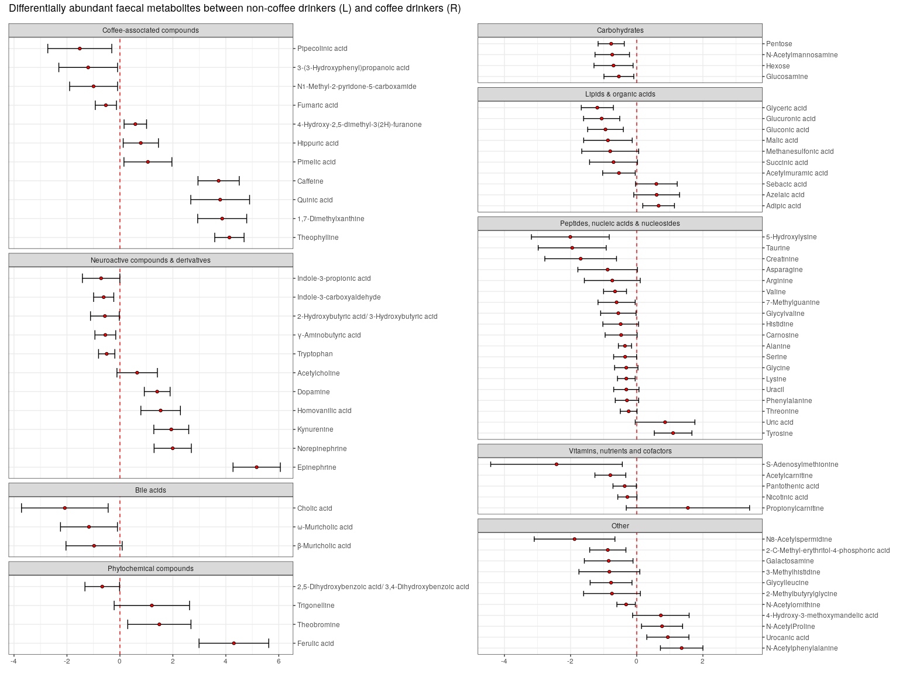
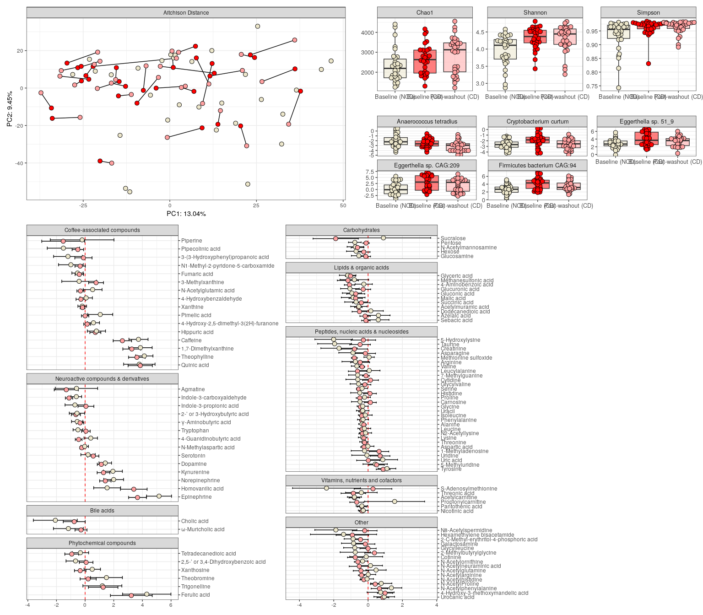
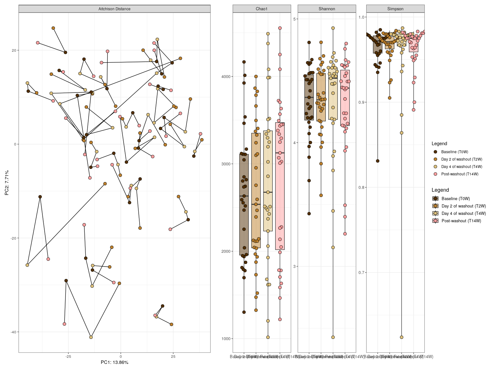
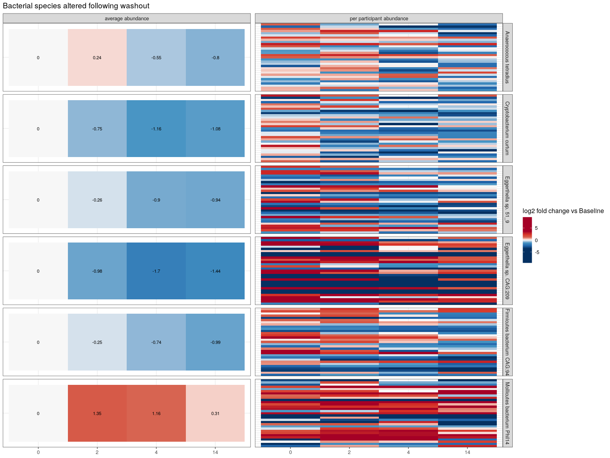
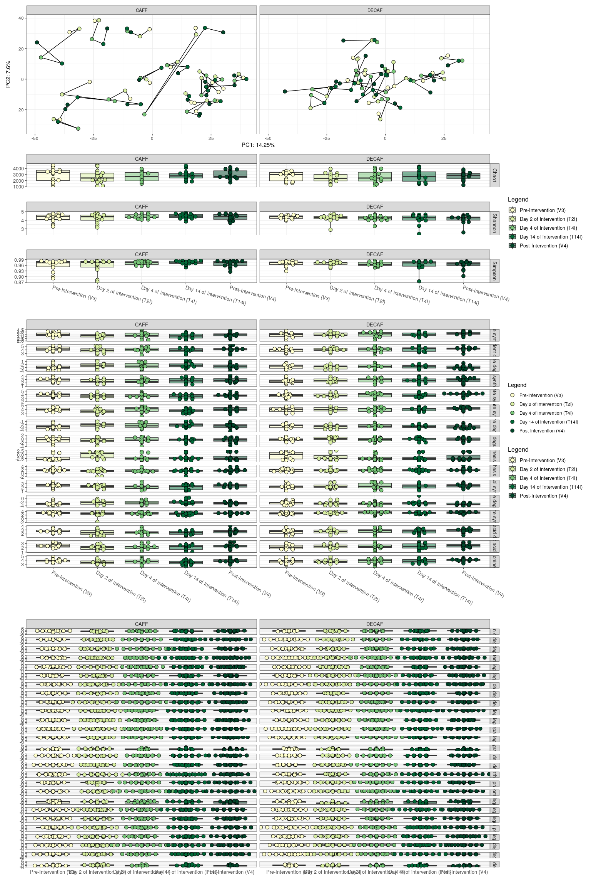

<p align="justify">
<!-- README.md is generated from README.Rmd. Please edit that file -->

In Experiment 1, we’re looking at differences in the microbiome between
coffee drinkers and non-coffee drinkers.

``` r
source("scripts/ex1_baseline_differences_CD_vs_NCD.R")
```

``` r
ex1_top
```

<!-- -->

``` r
ex1_metab_forest_a + ex1_metab_forest_b  + plot_layout(guides = 'collect') + 
  plot_annotation(title = "Differentially abundant faecal metabolites between non-coffee drinkers (L) and coffee drinkers (R)") 
```

<!-- -->

``` r
ex1_top + ex1_metab_forest + plot_layout(guides = 'collect', heights = c(1, 1, 2))
```

<!-- -->

In Experiment 2, we’re looking at features that return to non-coffee
drinker levels post washout (coffee abstinence).

``` r
source("scripts/ex_RESTORATION_coffee_analysis_post_washout_normalisation.R")
```

``` r
ex_RESTpca + ex_RESTalpha / ex_RESTDA + plot_layout(guides = 'collect')
```

<!-- -->

``` r
ex_REST_metab_forest_a + ex_REST_metab_forest_b + plot_layout(guides = 'collect') + 
  plot_annotation(title = "Differentially abundant faecal metabolites between non-coffee drinkers and coffee drinkers post-washout (L) vs baseline coffee drinker levels (R)")
```

<!-- -->

In this additional microbiome Experiment 2B, we’re looking at the acute
effects of coffee abstinence (coffee withdrawal).

``` r
source("scripts/ex_washout_acute_withdrawal.R")
```

``` r
ex_withdrawpca + ex_withdrawalpha + plot_layout(guides = 'collect')
```

<!-- -->

``` r
species_washout
```

<!-- -->

In Experiment 3, we’re looking at the effects of going back on either
caffeinated or decaffeinated coffee post-washout (coffee abstinence).

``` r
source("scripts/ex3_intervention_v3_vs_v4.R")
```

``` r
ex3pca + ex3alpha + plot_layout(guides = 'collect')
```

<!-- -->

``` r
ex3metab
```

<!-- -->

In this additional microbiome experiment 3B, we’re looking at the acute
effects of going back on either caffeinated or decaffeinated coffee
post-washout (coffee abstinence).

``` r
source("scripts/ex_INTERVENTION_acute_recaf_or_decaf.R")
```

    ## [1] "Using the following formula: x ~ Legend_ex_INTERVENTION + Treatment + (1 | participant_ID) + "
    ## [2] "Using the following formula:     Legend_ex_INTERVENTION:Treatment"                            
    ## [1] "Adjusting for FDR using Benjamini & Hochberg's procedure."

``` r
((ex_INTERVENTIONpca | ex_INTERVENTIONalpha) + plot_layout(widths = c(2,1), guides = 'collect')) / 
  (GBM_b  + plot_spacer() + GBM_a + plot_layout(guides = 'collect', widths = c(5,1,5))) /
  (GMM_b  + plot_spacer() + GMM_a + plot_layout(guides = 'collect', widths = c(5,1,5))) +  plot_layout(heights = c(3,4,1))
```

<!-- -->
