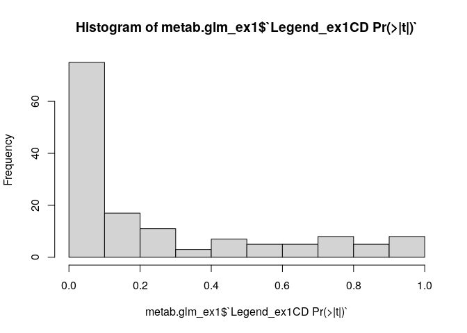
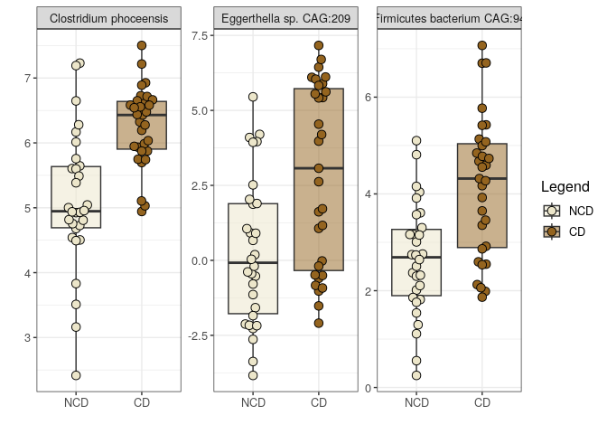

<p align="justify">
<!-- README.md is generated from README.Rmd. Please edit that file -->

In Experiment 1, we’re looking at differences in the microbiome between
coffee drinkers and non-coffee drinkers.

``` r
source("scripts/ex1_baseline_differences_CD_vs_NCD.R")
```

    ## Loading required package: permute

    ## Loading required package: lattice

    ## This is vegan 2.6-4

    ## Loading required package: Matrix

    ## 
    ## Attaching package: 'lmerTest'

    ## The following object is masked from 'package:lme4':
    ## 
    ##     lmer

    ## The following object is masked from 'package:stats':
    ## 
    ##     step

    ## ── Attaching core tidyverse packages ──────────────────────── tidyverse 2.0.0 ──
    ## ✔ dplyr     1.1.3     ✔ readr     2.1.4
    ## ✔ forcats   1.0.0     ✔ stringr   1.5.0
    ## ✔ ggplot2   3.4.4     ✔ tibble    3.2.1
    ## ✔ lubridate 1.9.3     ✔ tidyr     1.3.0
    ## ✔ purrr     1.0.2     
    ## ── Conflicts ────────────────────────────────────────── tidyverse_conflicts() ──
    ## ✖ tidyr::expand() masks Matrix::expand()
    ## ✖ dplyr::filter() masks stats::filter()
    ## ✖ dplyr::lag()    masks stats::lag()
    ## ✖ tidyr::pack()   masks Matrix::pack()
    ## ✖ tidyr::unpack() masks Matrix::unpack()
    ## ℹ Use the conflicted package (<http://conflicted.r-lib.org/>) to force all conflicts to become errors
    ## 
    ## Attaching package: 'scales'
    ## 
    ## 
    ## The following object is masked from 'package:purrr':
    ## 
    ##     discard
    ## 
    ## 
    ## The following object is masked from 'package:readr':
    ## 
    ##     col_factor

    ## [1] "Using the following formula: x ~ Legend_ex1"
    ## [1] "Adjusting for FDR using Benjamini & Hochberg's procedure."
    ## [1] "Using the following formula: x ~ Legend_ex1"
    ## [1] "Adjusting for FDR using Benjamini & Hochberg's procedure."
    ## [1] "Using the following formula: x ~ Legend_ex1"
    ## [1] "Adjusting for FDR using Benjamini & Hochberg's procedure."
    ## [1] "Using the following formula: x ~ Legend_ex1"
    ## [1] "Adjusting for FDR using Benjamini & Hochberg's procedure."

<!-- -->

``` r
ex1pca
```

<!-- -->

``` r
ex1alpha
```

<!-- -->

``` r
ex1DA
```

<!-- -->
