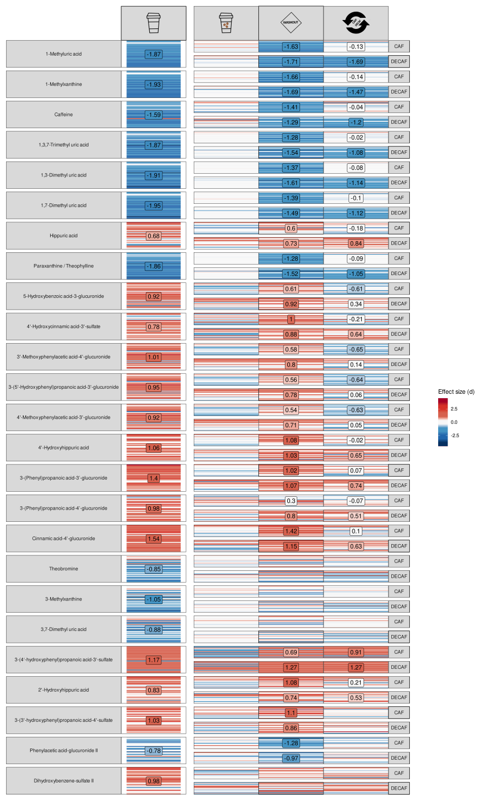

<p align="justify">

<!-- README.md is generated from README.Rmd. Please edit that file -->

Fig. 1a: Cognitive effects of coffee.

``` r
source("scripts/fig_1_behav_cog_health_data.R")
```

``` r
 (plot_cog <- (plot_cog_NCD | plot_cog_CD) + 
  plot_layout(guides = 'collect', widths = c(1,3)) & 
  theme(strip.text = element_text(size = 12)))
```


``` r
ggsave("figures/plot_cog.svg", plot = plot_cog)
```

``` r
plot_cog_craving & 
  theme(strip.text = element_text(size = 12), strip.text.y.left = element_text(hjust = 1))
```

<!-- -->

``` r
design_1 <- c("AAAAAAAAAAAABBCCCCCC
               AAAAAAAAAAAABBCCCCCC
               AAAAAAAAAAAABBCCCCCC
               DDDDDDDDDDDDBBCCCCCC
               DDDDDDDDDDDDBBCCCCCC
               DDDDDDDDDDDDBBCCCCCC")
(plot_spacer() + plot_cog_NCD + plot_cog_CD + plot_cog_craving) + plot_layout(design = design_1, guides = 'collect') & 
  theme(legend.position = 'left', 
        strip.text = element_text(size = 12), 
        strip.text.y.left = element_text(hjust = 1), 
        strip.text.x = element_markdown(size = 11)
        )
```

<!-- -->

``` r
design_1long <- c("
ABB
ABB
CCC")
(plot_cog_NCD + plot_cog_CD + plot_cog_craving) + plot_layout(design = design_1long, guides = 'collect') & 
  theme(legend.position = 'left', 
        strip.text = element_text(size = 12), 
        strip.text.y.left = element_text(hjust = 1), 
        strip.text.x = element_markdown(size = 11)
        )
```

<!-- -->

Fig 2a Microbiome

``` r
source("scripts/fig_2_gi_microbiome_data.R")
```

``` r
(plot_MB <- (plot_mb_NCD |  plot_mb_CD) + 
  plot_layout(guides = 'collect', widths = c(1,8)) & 
  theme(strip.text = element_text(size = 12), 
        strip.text.y.left = element_text(hjust = 1)
        ))
```

<!-- -->

``` r
ggsave("figures/plot_MB.svg", plot = plot_MB)
```

Fig 2b Metabolome

``` r
source("scripts/fig_2_gi_metabolome_data.R")
```

``` r
(plot_MT <- (plot_mt_NCD | plot_mt_CD) + 
  plot_layout(guides = 'collect', widths = c(1,3)) & 
  theme(strip.text = element_text(size = 12), 
        strip.text.y.left = element_text(hjust = 1)))
```

<!-- -->

``` r
ggsave("figures/plot_MT.svg", plot = plot_MT)
```

Fig 2b2 Urine Metabolome

``` r
source("scripts/fig_2_urine_metabolome_data_reclassed.R")
```

``` r
(plot_met_urine <- (plot_urmet_reclass_NCD  + plot_urmet_reclass_CD) + 
  plot_layout(widths = c(1,3), guides = 'collect') & 
  theme(strip.text = element_text(size = 12), 
        strip.text.y.left = element_text(hjust = 1)))
```

<!-- -->

``` r
ggsave("figures/plot_met_urine.svg", plot = plot_met_urine)


#Sometimes bugs out, so alternatively:

# ggsave(plot = plot_urmet_NCD + guides(fill= "none"), width = 11,  height = 45, units = "cm", device = "svg", filename = "stats/urine_plot_a.svg")
# ggsave(plot = plot_urmet_CD + guides(fill= "none"), width = 8,  height = 45, units = "cm", device = "svg", filename = "stats/urine_plot_b.svg")
```

Fig 2bx Targeted faecal metabolomics

``` r
source("scripts/fig_2_faecal_metabolome_data_reclassed.R")
```

``` r
(plot_met_fec <- (plot_fecmet_reclass_NCD | plot_fecmet_reclass_CD) + 
  plot_layout(guides = 'collect', widths = c(1,3)) & 
  theme(strip.text = element_text(size = 12), 
        strip.text.y.left = element_text(hjust = 1)))
```

<!-- -->

``` r
ggsave("figures/plot_met_fec.svg", plot = plot_met_fec)
```

Fig 2c Cytokines

``` r
source("scripts/fig_2_cytokine_data.R")
```

``` r
(plot_cyt_stim <- (plot_cyt_stim_NCD | plot_cyt_stim_CD) + 
  plot_layout(guides = 'collect', widths = c(1,3)) & 
  theme(strip.text = element_text(size = 12), 
        strip.text.y.left = element_text(hjust = 1)))
```

<!-- -->

``` r
ggsave("figures/plot_cyt_stim.svg", plot = plot_cyt_stim)
```

``` r
( plot_cyt_unstim <- (plot_cyt_unstim_NCD | plot_cyt_unstim_CD) + 
  plot_layout(guides = 'collect', widths = c(1,3)) & 
  theme(strip.text = element_text(size = 12), 
        strip.text.y.left = element_text(hjust = 1)))
```

<!-- -->

``` r
ggsave("figures/plot_cyt_unstim.svg", plot = plot_cyt_unstim)
```

``` r
# source("scripts/fig_final_integration.R")
```

``` r
# fig_int
```

``` r
# source("scripts/fig_final_integration_MB_fecmet_cog.R")
```

``` r
# fig_int_mb_fecmet_cog
```

``` r
# source("scripts/fig_final_integration_MB_urmet_cog.R")
```

``` r
# fig_int_mb_urmet_cog
```

\#Microbiome in the middle

``` r
# source("scripts/fig_final_integration_fecmet_MB_behav.R")
```

``` r
# fig_int_fecmet_MB_cog 
```

``` r
# source("scripts/fig_final_integration_urmet_MB_behav.R")
```

``` r
# fig_int_urmet_MB_cog
```

``` r
#source("scripts/generate_stats_tables.R")
```
