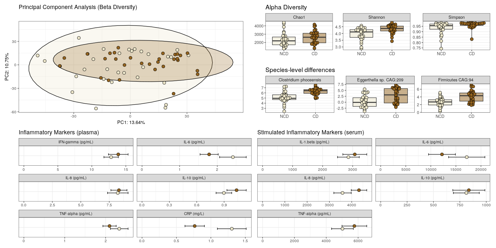
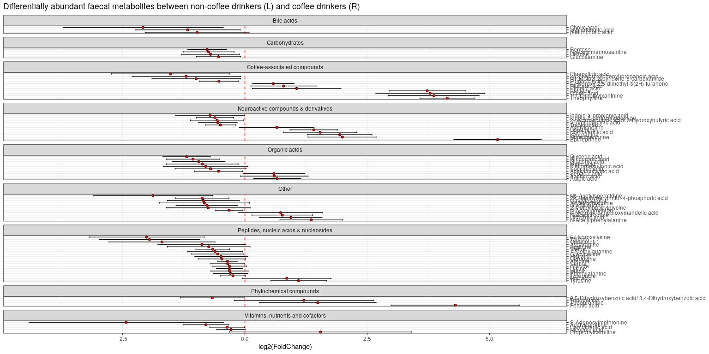
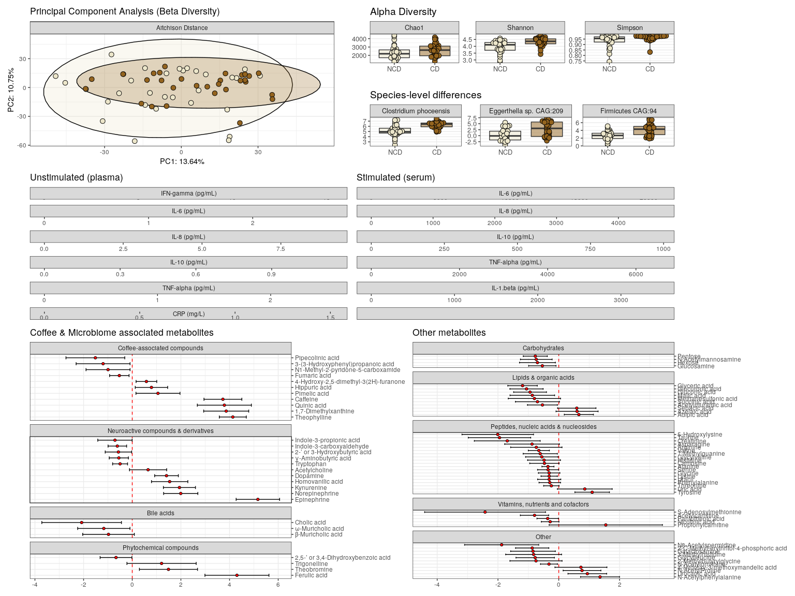
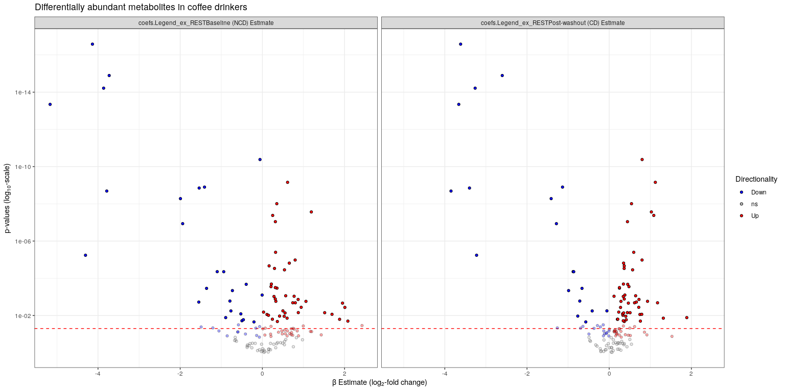
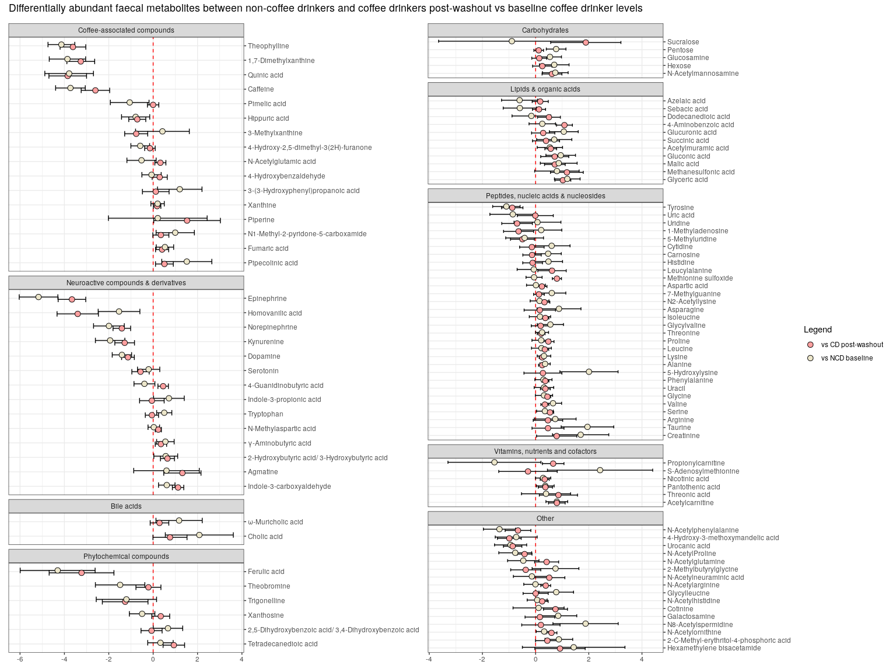
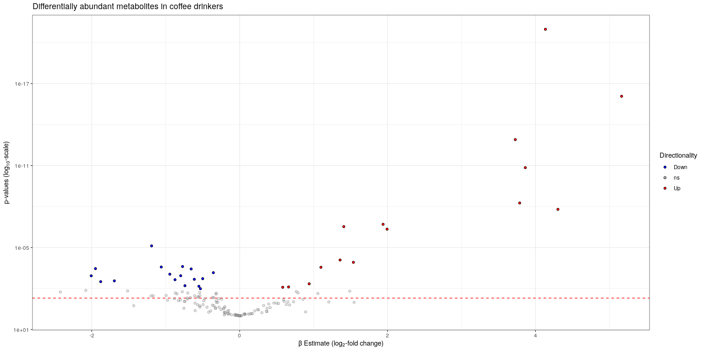
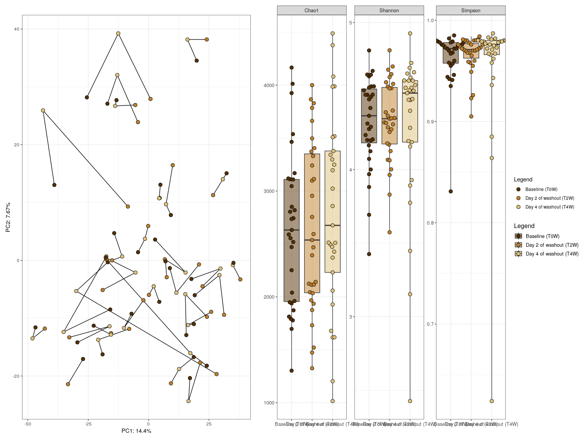

<p align="justify">
<!-- README.md is generated from README.Rmd. Please edit that file -->

In Experiment 1, we’re looking at differences in the microbiome between
coffee drinkers and non-coffee drinkers.

``` r
source("scripts/ex1_baseline_differences_CD_vs_NCD.R")
```

    ## [1] "Using the following formula: x ~ Legend_ex1"
    ## [1] "Adjusting for FDR using Benjamini & Hochberg's procedure."
    ## [1] "Using the following formula: x ~ Legend_ex1"
    ## [1] "Adjusting for FDR using Benjamini & Hochberg's procedure."
    ## [1] "Using the following formula: x ~ Legend_ex1"
    ## [1] "Adjusting for FDR using Benjamini & Hochberg's procedure."
    ## [1] "Using the following formula: x ~ Legend_ex1"
    ## [1] "Adjusting for FDR using Benjamini & Hochberg's procedure."

``` r
ex1pca + ex1alpha / ex1DA + plot_layout(guides = 'collect')
```

<!-- -->

``` r
ex1DA_metab
```

<!-- -->

In Experiment 2B, we’re looking at features that return to non-coffee
drinker levels post washout (coffee abstinence).

``` r
source("scripts/ex_RESTORATION_coffee_analysis_post_washout_normalisation.R")
```

    ## [1] "Using the following formula: x ~ Legend_ex_REST + (1 | participant_ID)"
    ## [1] "Adjusting for FDR using Benjamini & Hochberg's procedure."
    ## [1] "Using the following formula: x ~ Legend_ex_REST + (1 | participant_ID)"
    ## [1] "Adjusting for FDR using Benjamini & Hochberg's procedure."
    ## [1] "Using the following formula: x ~ Legend_ex_REST + (1 | participant_ID)"
    ## [1] "Adjusting for FDR using Benjamini & Hochberg's procedure."
    ## [1] "Using the following formula: x ~ Legend_ex_REST + (1 | participant_ID)"
    ## [1] "Adjusting for FDR using Benjamini & Hochberg's procedure."

``` r
ex_RESTpca + ex_RESTalpha / ex_RESTDA + plot_layout(guides = 'collect')
```

<!-- -->

``` r
ex_REST_DA_metab
```

<!-- -->

In Experiment 3, we’re looking at the effects of going back on either
caffeinated or decaffeinated coffee post-washout (coffee abstinence).

``` r
source("scripts/ex3_intervention_v3_vs_v4.R")
```

    ## [1] "Using the following formula: x ~ visit + Treatment + (1 | participant_ID) + visit:Treatment"
    ## [1] "Adjusting for FDR using Benjamini & Hochberg's procedure."
    ## [1] "Using the following formula: x ~ visit + Treatment + (1 | participant_ID) + visit:Treatment"
    ## [1] "Adjusting for FDR using Benjamini & Hochberg's procedure."
    ## [1] "Using the following formula: x ~ visit + Treatment + (1 | participant_ID) + visit:Treatment"
    ## [1] "Adjusting for FDR using Benjamini & Hochberg's procedure."
    ## [1] "Using the following formula: x ~ visit + Treatment + (1 | participant_ID) + visit:Treatment"
    ## [1] "Adjusting for FDR using Benjamini & Hochberg's procedure."

``` r
ex3pca + ex3alpha + plot_layout(guides = 'collect')
```

<!-- -->

``` r
ex3metab
```

<!-- -->

In this additional microbiome experiment, we’re looking at the acute
effects of going back on either caffeinated or decaffeinated coffee
post-washout (coffee abstinence).

``` r
source("scripts/ex_INTERVENTION_acute_recaf_or_decaf.R")
```

    ## [1] "Using the following formula: x ~ Legend_ex_INTERVENTION + Treatment + (1 | participant_ID) + "
    ## [2] "Using the following formula:     Legend_ex_INTERVENTION:Treatment"                            
    ## [1] "Adjusting for FDR using Benjamini & Hochberg's procedure."
    ## [1] "Using the following formula: x ~ Legend_ex_INTERVENTION + Treatment + (1 | participant_ID) + "
    ## [2] "Using the following formula:     Legend_ex_INTERVENTION:Treatment"                            
    ## [1] "Adjusting for FDR using Benjamini & Hochberg's procedure."
    ## [1] "Using the following formula: x ~ Legend_ex_INTERVENTION + Treatment + (1 | participant_ID) + "
    ## [2] "Using the following formula:     Legend_ex_INTERVENTION:Treatment"                            
    ## [1] "Adjusting for FDR using Benjamini & Hochberg's procedure."

``` r
ex_INTERVENTIONpca + ex_INTERVENTIONalpha + ex_INTERVENTIONDA_GBM + ex_INTERVENTIONDA_GMM +  plot_layout(guides = 'collect')
```

<!-- -->
