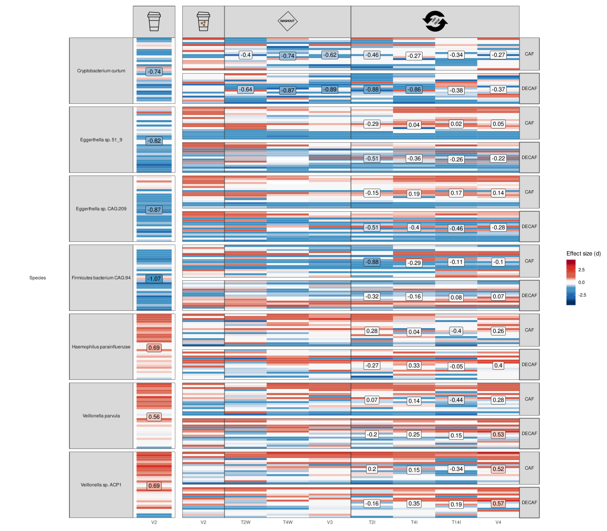
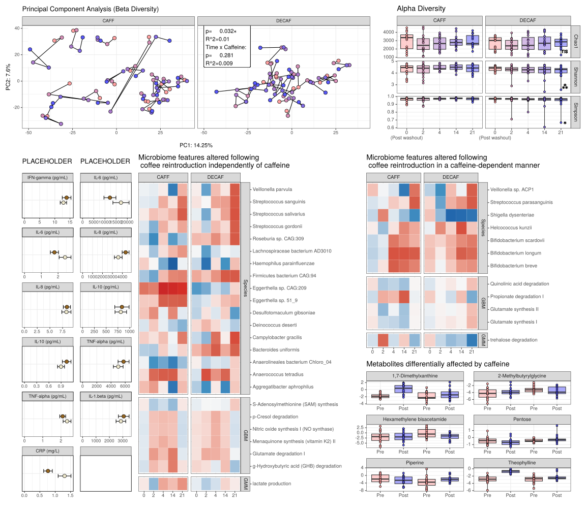

<p align="justify">
<!-- README.md is generated from README.Rmd. Please edit that file -->

In Experiment 1, we’re looking at differences in the microbiome between
coffee drinkers and non-coffee drinkers.

``` r
source("scripts/ex1_baseline_differences_CD_vs_NCD.R")
```

``` r
(ex1pca | (ex1alpha | ex1DA)) / 
  ((ex1_cyta  + ex1_cytb  + ex1_metab_forest_a  + ex1_metab_forest_b + plot_spacer()) + plot_layout(widths = c(1,1,2,2, 0.1))) + plot_layout(heights = c(2,3))
```

<!-- -->

In Experiment 2, we’re looking at features that return to non-coffee
drinker levels post washout (coffee abstinence).

``` r
source("scripts/ex_2_acute_and_full_withdrawal.R")
```

``` r
  ((ex_RESTpca + ex_RESTalpha + ex_RESTDA + plot_layout(widths = c(6,2,5))) / 
   ((ex1_cyta + ggtitle("PLACEHOLDER") | ex1_cytb + ggtitle("PLACEHOLDER") | ex_REST_metab_forest_a | ex_REST_metab_forest_b | plot_spacer()) + plot_layout(widths = c(1,1,2,2, 0.1))))  + plot_layout(heights = c(4,7))
```

<!-- -->

In Experiment 3, we’re looking at the effects of going back on either
caffeinated or decaffeinated coffee post-washout (coffee abstinence).

In this additional microbiome experiment 3B, we’re looking at the acute
effects of going back on either caffeinated or decaffeinated coffee
post-washout (coffee abstinence).

``` r
source("scripts/ex_3_intervention_acute_and_full_recaf_or_decaf.R")
```

    ## [1] "Using the following formula: x ~ Legend_ex_INTERVENTION + Treatment + (1 | participant_ID) + "
    ## [2] "Using the following formula:     Legend_ex_INTERVENTION:Treatment"                            
    ## [1] "Adjusting for FDR using Benjamini & Hochberg's procedure."

``` r
(
  (
    (ex_INTERVENTIONpca | ex_INTERVENTIONalpha) + 
     plot_layout(widths = c(2,1), guides = 'collect')
    ) 
  / 

    (
      (ex1_cyta + ggtitle("PLACEHOLDER") | ex1_cytb + ggtitle("PLACEHOLDER")  | mb_b | (((mb_a |plot_spacer()) + plot_layout(widths = c(9,1))) / ex3metab) + plot_layout(heights = c(3,2))) + 
  
            plot_layout(guides = 'collect', widths = c(1,1,2,4))
      )
  ) + 

    plot_layout(heights = c(1,3))
```

<!-- -->
