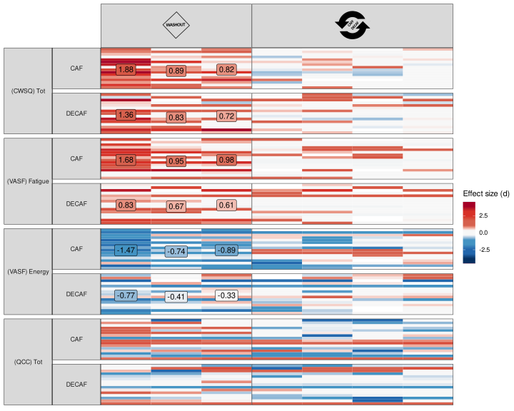
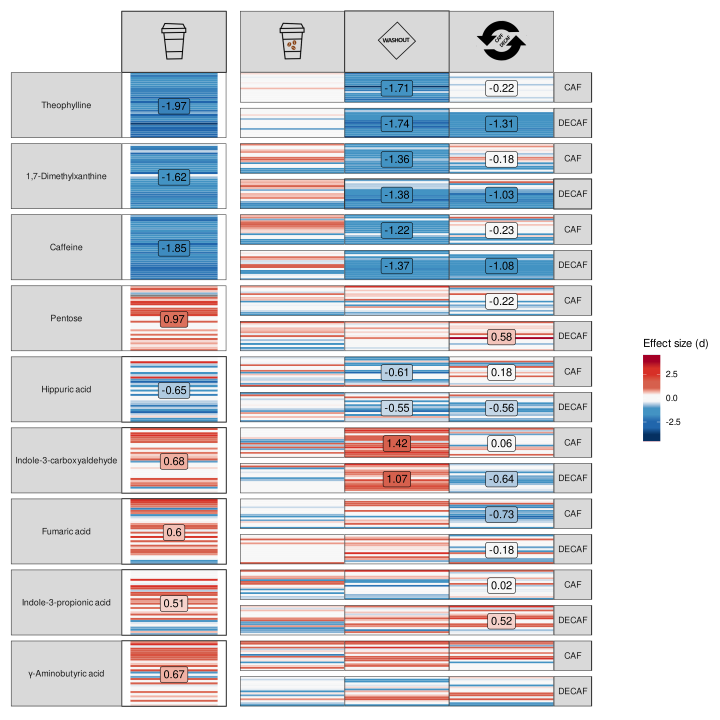

<p align="justify">
<!-- README.md is generated from README.Rmd. Please edit that file -->

Fig. 1a: Cognitive effects of coffee.

``` r
source("new_scripts/fig_1_behav_cog_health_data.R")
```

``` r
(plot_cog_NCD | plot_cog_CD) + 
  plot_layout(guides = 'collect', widths = c(1,3))
```

<!-- -->

``` r
plot_cog_craving
```

<!-- -->

Fig 2a Microbiome

``` r
source("new_scripts/fig_2_gi_microbiome_data.R")
```

``` r
(plot_mb_NCD |  plot_mb_CD) + 
  plot_layout(guides = 'collect', widths = c(1,8))
```

<!-- -->

Fig 2b Metabolome

``` r
source("new_scripts/fig_2_gi_metabolome_data.R")
```

``` r
(plot_mt_NCD | plot_mt_CD) + 
  plot_layout(guides = 'collect', widths = c(1,3))
```

<!-- --> Fig 2c
Cytokines

``` r
source("new_scripts/fig_2_cytokine_data.R")
```

``` r
(plot_cyt_stim_NCD | plot_cyt_stim_CD) + 
  plot_layout(guides = 'collect', widths = c(1,3))
```

<!-- -->

``` r
(plot_cyt_unstim_NCD | plot_cyt_unstim_CD) + 
  plot_layout(guides = 'collect', widths = c(1,3))
```

<!-- -->

``` r
source("new_scripts/fig_final_integration.R")
```

``` r
fig_alluvial
```

<!-- -->
